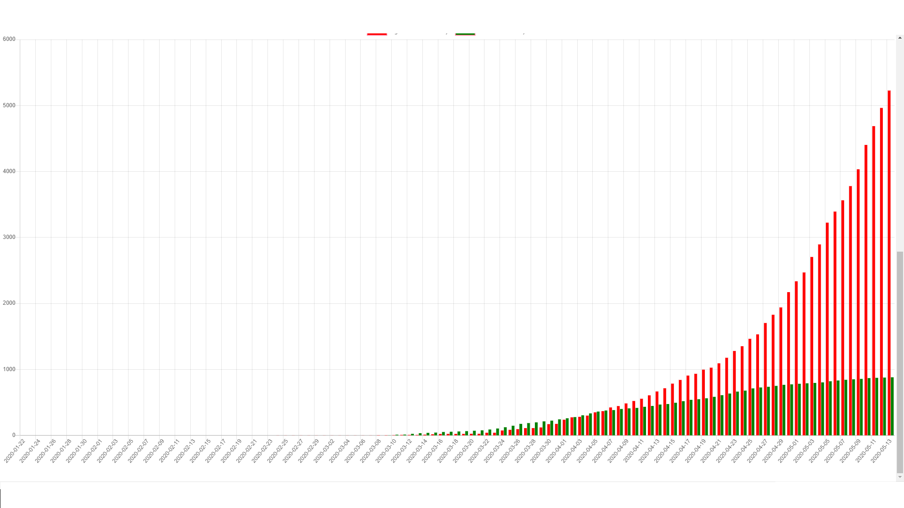

## Table of contents
* [General info](#general-info)
* [Technologies](#technologies)
* [Setup](#setup)

## General info
This project is Website which shows current Covid 19 status
	
## Technologies
Project is created with:
* HTML
* Bootstrap
* chart.js
* covid19api.com
* Jquery
* css
	
## Setup
To run this project just download and open index.html on local server emulator 

##Information
This website is my school project, mainly is frontend for covid Api, you can check updated status of pandemic situation in your country and compare with second country.

## Screen shots

